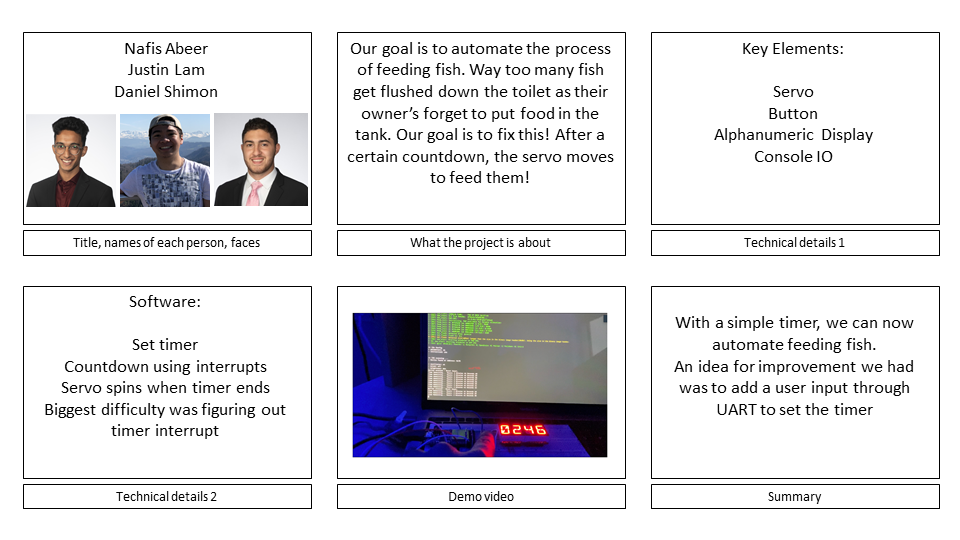

# Quest Name
Fish Feeder

Authors: Nafis Abeer, Justin Lam, Daniel Shimon
Team_Return_NoSleep()

Date: 2021-02-18
-----

## Summary
In this quest, we created an independent timer to control when to feed our fish. We wired an Alphanumeric Display to show our timer, as well as a servo to feed the fish. There is also a wired push-button to start the timer countdown. Our code enables us to simply set a timer and then sit back and let our countdown do the work. No fish will ever go hungry again!

## Self-Assessment

### Objective Criteria

| Objective Criterion | Rating | Max Value  |
|---------------------------------------------|:-----------:|:---------:|
| Objective One | 1 |  1     |
| Objective Two | 1 |  1     |
| Objective Three | 1 |  1     |
| Objective Four | 1 |  1     |
| Objective Five | 1 |  1     |
| Objective Six | 1 |  1     |

### Qualitative Criteria

| Qualitative Criterion | Rating | Max Value  |
|---------------------------------------------|:-----------:|:---------:|
| Quality of solution | 4 |  5     |
| Quality of report.md including use of graphics | 3 |  3     |
| Quality of code reporting | 2 |  3     |
| Quality of video presentation | 3 |  3     |

## Solution Design

Our code solution Design utilizes both hardware and software interrupts to control our timer. The push button triggers a flag in the program that starts the countdown. A separate flag detects every second, decreasing our timer by 1 second. Once the timer reaches zero seconds, the servo spins left and right 3 times and the 'time' is reset to the initial countdown value.

We used an Adafruit 0.56" 4-Digit 14-Segment Display w/ FeatherWing to Display our timer. The pins used for communications are:

    SCL -> pin 22 on ESP32
    SDA -> pin 23 on ESP32

1k Ohm resisters were used for each pin of the Alphanumeric Display.

After exhaustive testing, we found our demonstration servo to achieve a max range of 180 degrees. Our optimal signal input pulse width was determined to be between 500-2500 us (0.5-2.5 ms) The servo connects to the 3.3V, Ground, and pin 21 on the ESP32

Last but not least, our push button utilizes a 330 Ohm resistor and connects to the 3.3V, Ground, and pin 15 on the ESP32

Investigation Question: Of course, the current design has room for improvement to achieve a user-friendly product. This is basically like going to the store and buying an alarm clock that would only wake you up at 5:00 am. This might be great for some people, however probably not most. Users want to be able to set when they wake up, just as in this case they would want to decide when to feed their fish. An idea would be to read in user input from the UART, and set the timer value to this user input. Therefore the food would be dispensed when the user wants it to, and not the set value.

## Sketches and Photos

Fish Feeder Implementation

## Supporting Artifacts
https://youtu.be/HnG3Znr49v0

Storyboard

## Modules, Tools, Source Used Including Attribution

## References
esp-idf/examples/peripherals/timer_group/main/timer_group_example_main.c
esp-idf/examples/peripherals/mcpwm/mcpwm_servo_control/main/mcpwm_servo_control_example.c
esp-idf/examples/peripherals/uart/uart_async_rxtxtasks/main/uart_async_rxtxtasks_main.c
esp-idf/examples/peripherals/i2c/i2c_self_test/main/i2c_example_main.c

-----
