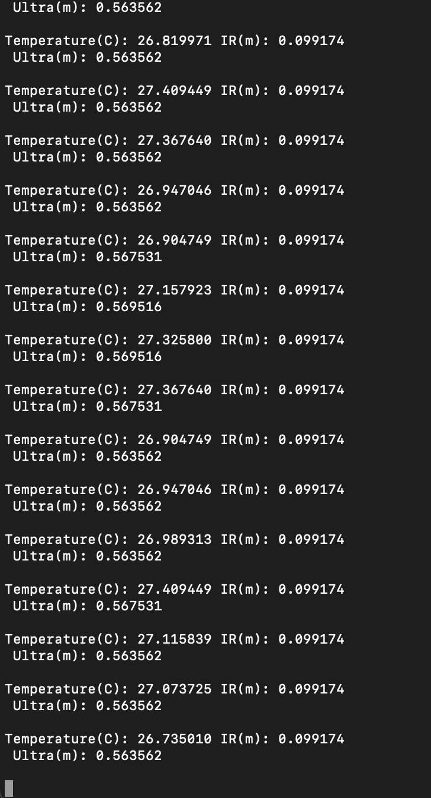
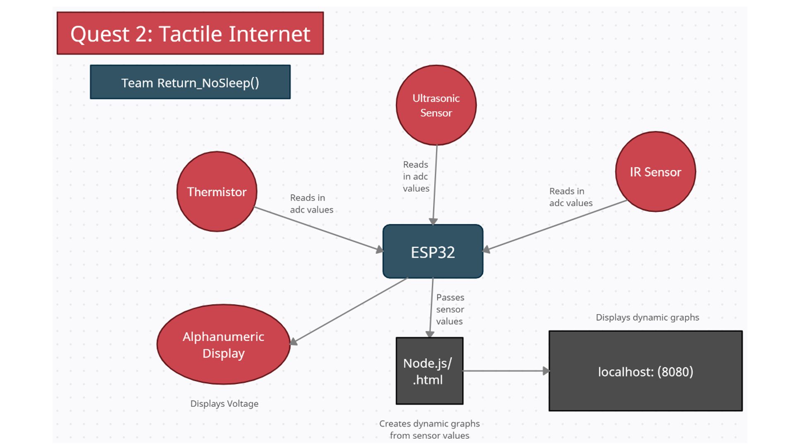

# Tactile Internet

Authors: Nafis Abeer, Justin Lam, Daniel Shimon
Team_Return_NoSleep()

Date: 2021-3-5
-----

## Summary
In this quest, we read values from 3 different sensors, a temperature probe, an ultrasonic sensor, and an IR sensor, and furthermore display these readings as both text to the console, as well as to the host in the format of a chart. This chart is continuously updated every 2 seconds to read in new values as they are read by each respective sensor, creating a real time strip-chart display.

## Self-Assessment

### Objective Criteria

| Objective Criterion | Rating | Max Value  |
|---------------------------------------------|:-----------:|:---------:|
| Objective One | 1 |  1     |
| Objective Two | 1 |  1     |
| Objective Three | 1 |  1     |
| Objective Four | 1 |  1     |
| Objective Five | 1 |  1     |
| Objective Six | 1 |  1     |
| Objective Seven | 1 |  1     |

### Qualitative Criteria

| Qualitative Criterion | Rating | Max Value  |
|---------------------------------------------|:-----------:|:---------:|
| Quality of solution | 5 |  5     |
| Quality of report.md including use of graphics | 3 |  3     |
| Quality of code reporting | 2 |  3     |
| Quality of video presentation | 3 |  3     |

## Solution Design
Our solution makes use of FreeRTOS along with timer interrupts and ADC pins to allow the ESP32 to read data from an IR sensor, an Ultrasonic sensor and a temperature probe. We also outputted the voltage of individual sensors to an alphanumeric display to get a live display of the analog voltages being fed to the microcontroller. The turned in project only displays this voltage for the temperature probe, but it can be configured to display the voltage of any of sensors through the code.

In terms of hardware we take input from the thermistor through ADC_channel_6 or GPIO pin 34, we outputted the analog voltage of the ultrasonic sensor from GPIO pin 39, or ADC channel 3 and the IR sensor to GPIO pin 33 or ADC channel 5.

We used an Adafruit 0.56" 4-Digit 14-Segment Display w/ FeatherWing to Display our timer. The pins used for communications are:

    SCL -> pin 22 on ESP32
    SDA -> pin 23 on ESP32

The thermistor receives power from the USB port of the ESP. It shares power with a 660 ohms resistor (two 330 ohm resistors in series). This is so that we can calculate the resistance of the thermistor as the resistance changes in reaction to the temperature of it is experiencing.

The IR sensor receives power from the 5 volt usb port of the usb and outputs analog voltage that have an inverse relationship the distance to the nearest object it is facing. Those voltage is read in through the ADC pin.

The ultrasonic sensor directly feeds analog voltage to the ADC pins that have a direct relationship of the nearest object the sensor is facing.

The C code simply takes in raw values from the ADC readings and converts the values to voltage. The ADC voltage is then converted to resistance for the thermistor and kept as volts for the distance sensors, and with the help of some formulas, converted to degrees Celcius, and meters to be outputted to the console

the js code reads takes the values from the console and parses it so the html can create and render the three dynamic graphs made for each sensor. The graphs are able to be observed on localhost: (8080).

Investigative Question:
As mentioned in the Demo video, the IR sensor responds more quickly and accurately to changes in the object it is facing. This is proven as in the video, both sensors are pointed up (about 1.3 meters), straight (about 38 cm) and left (about 4 meters) and the IR sensor accurately outputted those values to the console within almost two seconds. The coding solution took an average of the meter readings for the duration of that two second interval and outputted that average at that two second mark, which indicates that the IR sensor has a shorter adjustment period. The demo video will show that the ultra sonic sensor had a much longer adjustment period, which is why an IR sensor is more fit than the ultrasonic sensor to support a robotic car.

## Sketches and Photos
Circuit:

Local host:

Console:

## Supporting Artifacts
https://www.youtube.com/watch?v=QOHd4zOB3Uo

Storyboard:

Flowchart for video:

## Modules, Tools, Source Used Including Attribution
ESP32
FreeRTOS
timer interupts and handlers
ADC
I2C
Node.js
Express
Canvas.js

## References
https://docs.espressif.com/projects/esp-idf/en/latest/esp32/api-reference/peripherals/adc.html
-----
