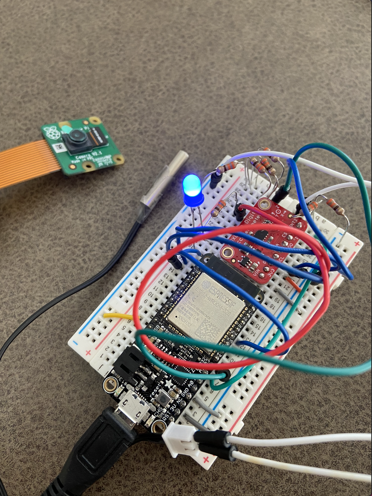
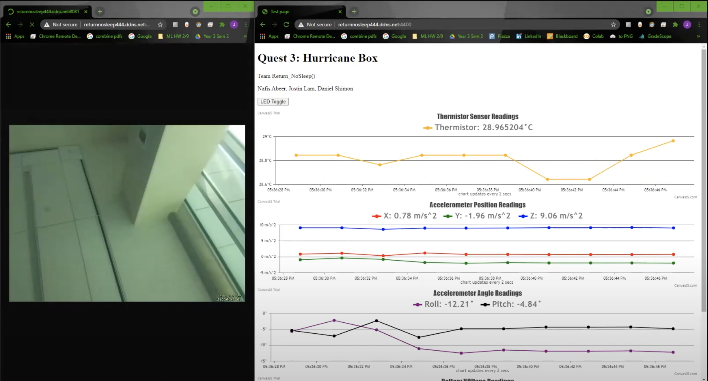
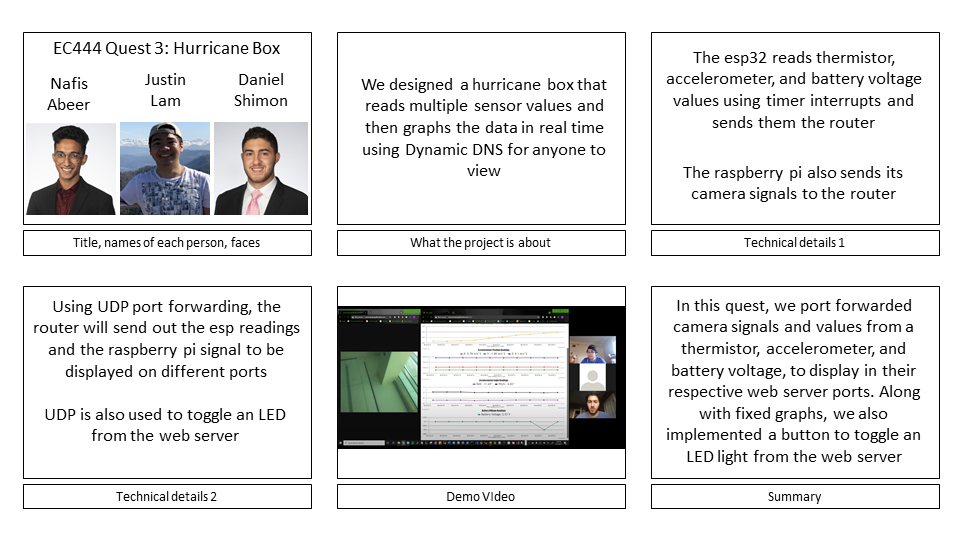
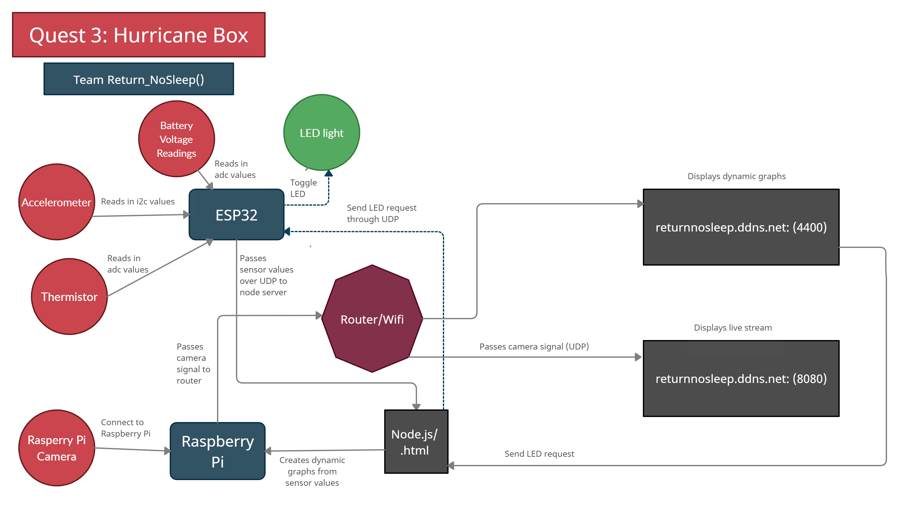

# Hurricane Box with Remote Access
Authors: Daniel Shimon, Nafis Abeer, Justin Lam

Date: 2021-03-25
-----

## Summary
In this Quest, we connect the ESP32 to read values from the accelerometer and temperature probe, as well as connect to an LED.
The ESP32 is connected to WiFi, and using UDP we can send these readings over to our Node.JS server. This server is running on
the Raspberry Pi, and receives these readings. These values are split up into its respective parts, and are sent over to the HTML
file to be graphed using Canvas.JS. The HTML file also contains a button to toggle the LED, which send a POST form to get registered by the server and send the corresponding information to the ESP, about whether to toggle the LED or not.

This Quest integrated multiple current as well as past skills, such as reading from the accelerometer, reading from the temperature probe, working with the LED, as well as graphing using Canvas. One new element to this Quest was the ability to register a button click on the client side, to toggle the LED. Putting all of these new skills together, we were able to create a 'Hurricane Box with Remote Access' to read in these values while being outside of the network, as well as being able to control elements of this Hurricane Box remotely.

## Self-Assessment

### Objective Criteria

| Objective Criterion | Rating | Max Value  |
|---------------------------------------------|:-----------:|:---------:|
| Objective One | 1 |  1     |
| Objective Two | 1 |  1     |
| Objective Three | 1 |  1     |
| Objective Four | 1 |  1     |
| Objective Five | 1 |  1     |
| Objective Six | 1 |  1     |
| Objective Seven | 1 |  1     |

### Qualitative Criteria

| Qualitative Criterion | Rating | Max Value  |
|---------------------------------------------|:-----------:|:---------:|
| Quality of solution |  |  5     |
| Quality of report.md including use of graphics |  |  3     |
| Quality of code reporting |  |  3     |
| Quality of video presentation |  |  3     |

## Solution Design

Our solution makes use of ADC, I2C, as well as GPIO. We separated the functionalities of each hardware component with FreeRTOS tasks. We also implemented timer interrupts to only process readings from these components every two seconds. The pins for the accelerometer went from the SCL and SDA of the accelerometer to the ESP. The accelerometer receives power from the 3V input and it is also connected to the ESP32's ground. Its data is read in using the SDA and SCL pins listed below. The thermistor is connected to the 5 volt usb power and it is grounded by a 330 ohm resistor. The LED light receives power from a GPIO pin and is grounded by a 330 ohm resistor. The Voltage Divider displays the voltage of 660 ohms divided by another 660 ohm so the reading on the server is only half of the power being supplied out of the USB pin of the ESP32. It should be noted that the LED gpio pin is set on and off based on a variable that gets switched if our server indicates that an HTML button had been pressed.

  SCL -> pin 22 on ESP32
  SDA -> pin 23 on ESP32
  Thermistor ADC_channel_6  -> pin 34 on ESP32
  Voltage Divider ADC_channel_3 -> pin 39 on ESP32
  LED GPIO -> pin 18 on ESP32

The data is printed every two seconds and placed inside a payload variable before being sent out by the UDP socket. The UDP socket sends data to the ip address listed of the RPI because that is where our node server is hosted. The connection is two-way meaning the server can also send data back to the ESP32, which is how we toggle the LED light.

The node server runs on the RPI and receives data from the ESP through a socket and then parses the data before sending it out to an HTML file to be plotted.

There are a couple of steps and methods to improve our system to be low powered. IF we decreased the frequency of the sensors getting and receiving data, that would equate to more time of the system doing nothing. From there, we could program the system to sleep/use minimum voltage while values/signals are not being transferred.

## Sketches and Photos

Circuit:

Web Server (both camera and hurricane box in separate ports at the same time):

## Supporting Artifacts
https://youtu.be/jcxE8yhjTSo

Storyboard:

Flowchart for video:

Code:
.
.
.

## Modules, Tools, Source Used Including Attribution

ESP32,
Raspberry Pi,
Raspberry Pi Camera,
Accelerometer,
timer interupts and handlers,
ADC,
I2C,
Node.js,
Express,
Canvas.js

## References
https://www.w3schools.com/tags/att_form_method.asp
-----
