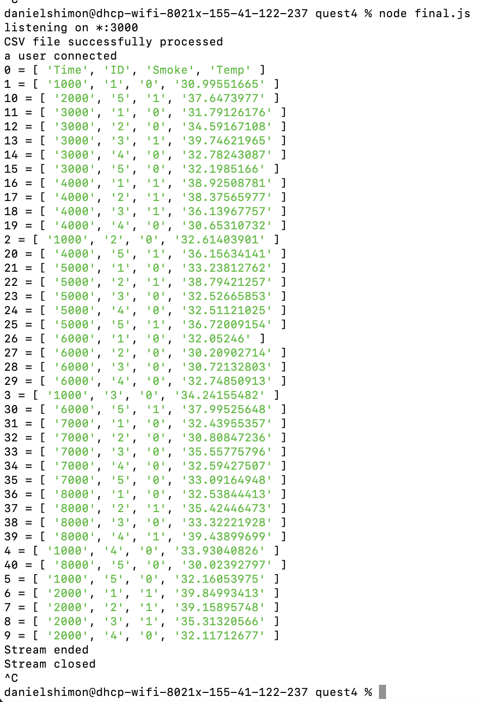

# Persistence and Database

Author: Daniel Shimon, Nafis Abeer, Justin Lam

Date: 2021-04-06
-----

## Summary
The purpose of this skill is to be able to save information in key->value pairings in a database, to ensure that this data won't just disappear if there is an issue. As a team we chose to use LevelDb, as it is super easy to implement with node. By using a very similair implemenation from skill 17, we were able to just add a db.put function to insert data into the database as it was parsed. From there, the data is queried once a connection to the client interface is made, and from there all of the key-value pairings appear in the terminal. 

Note: We did not configure the client to actually read any of this data over, it is unchanged from the class documentation example,which is why it isn't listed as a supporting artifcat, we simply use it to register that a connection has been made.

## Sketches and Photos
This image shows all of the key-values logged in the terminal.

## Modules, Tools, Source Used Including Attribution
Used the example from the class: Design Pattern – Databases + Visualization. We pulled in both the client and server side code. 

## Supporting Artifacts
JavaScript Code:

-----
