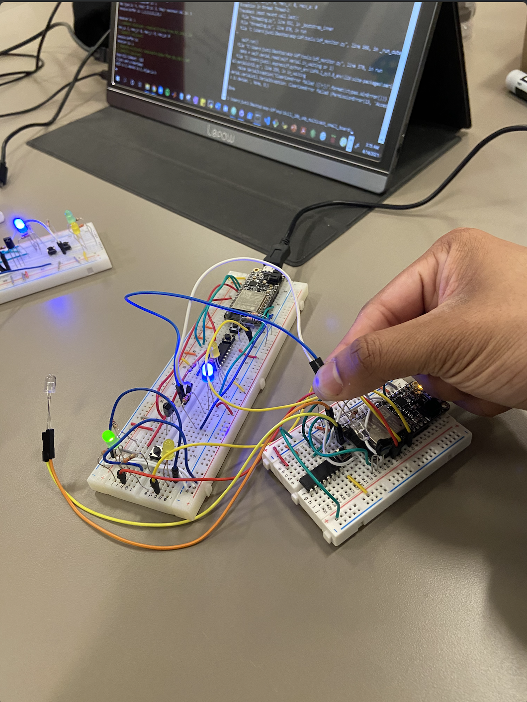
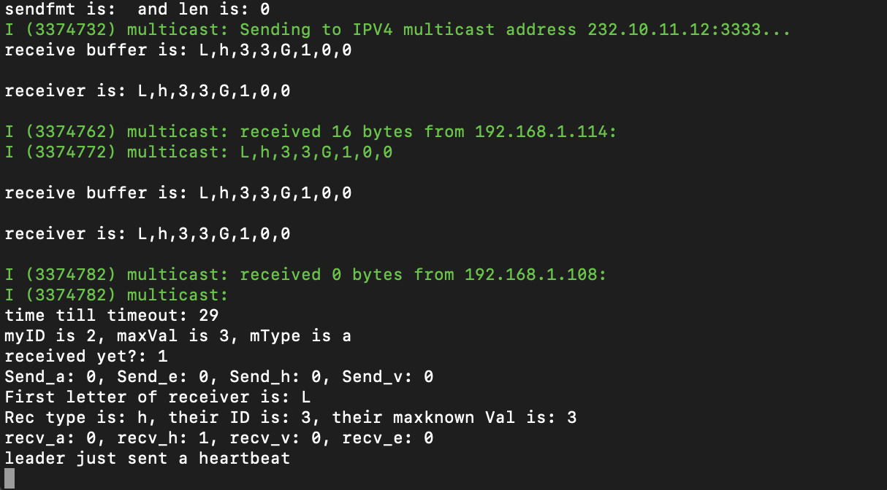
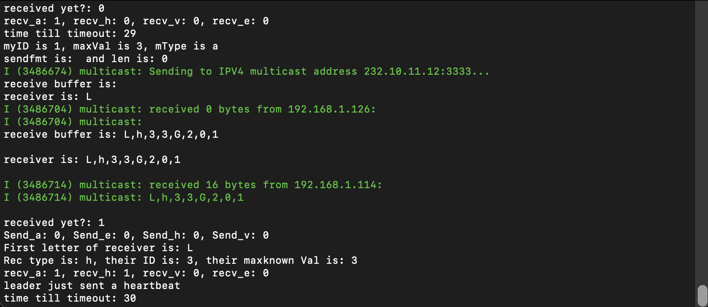
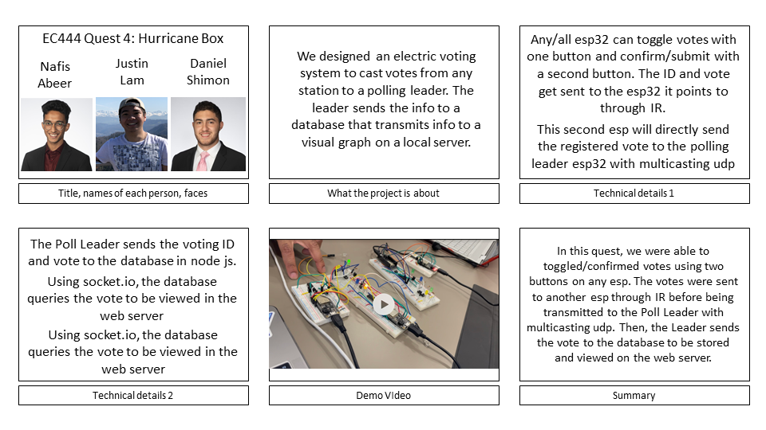
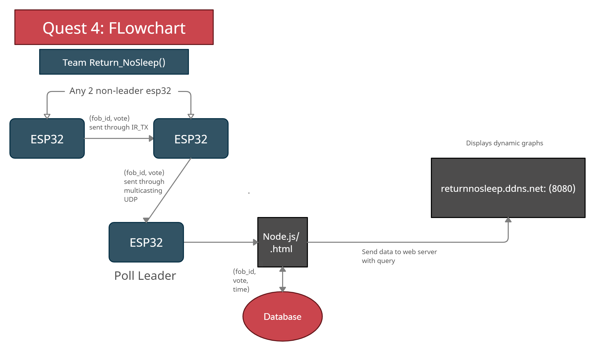

# Leader Election

Authors: Daniel Shimon, Nafis Abeer, Justin Lam

Date: 2021-04-13
-----

## Summary

In this Quest, we run an general election of two candidates meanwhile running another election between our ESPs to eventually come to a conclusion about the Poll Leader is between the ESPs (one with the highest ID), as well as who is the winner of the Election between the candidates. LevelDB is also used as the database to store these election polling results, to then be displayed using a bar-graph to show the results on the web-client.

The IR/TX skill is used by sending a vote for a leader from Fob to Fob. Through UDP Multicast communication, we are able to first "talk" between the ESPs as shown in the Leader Election team skill. The red onboard LED will turn on when a Poll Leader has been decided, and logic has been implemented to implement the bully algorithm if a new leader must be chosen among the Poll Leaders. Furthermore, we are able to send each vote to the server using UDP Multicast communication as well over the local network.

The Database skill is implemented so that each vote that the Leader sends is put into the Database, and further queried by the client to be displayed as a bar-graph total showing the total votes for each Candidate

## Self-Assessment

### Objective Criteria

| Objective Criterion | Rating | Max Value  |
|---------------------------------------------|:-----------:|:---------:|
| Objective One | 1 |  1     |
| Objective Two | 1 |  1     |
| Objective Three | 1 |  1     |
| Objective Four | 1 |  1     |
| Objective Five | 1 |  1     |
| Objective Six | 1 |  1     |
| Objective Seven | 1 |  1     |

### Qualitative Criteria

| Qualitative Criterion | Rating | Max Value  |
|---------------------------------------------|:-----------:|:---------:|
| Quality of solution | 3 |  5     |
| Quality of report.md including use of graphics | 3 |  3     |
| Quality of code reporting | 3 |  3     |
| Quality of video presentation | 3 |  3     |

## Solution Design

### Hardware
Our solution makes use of a lot of GPIO pins. The ESP uses the following GPIO pins:

  Button to toggle LED vote -> pin 33 on ESP32
  Button to confirm LED vote -> pin 5 on ESP32
  Green/Blue LED -> pin 13 on ESP32
  Yellow LED -> pin 12 on ESP32
  H-bridge -> pin A0 and A2 on ESP32
  IR receiver -> GPIO 34 on ESP32
  IR transmitter -> H-bridge

The LED's and IR receivers/transmitters utilized 330 ohms and 220 ohms resistors, while the button utilized 10k ohm resistors.

### C - code
Our software solution makes use of UDP multicast to broadcast messages. The node server technically hears these broadcasts but only processes votes if it is coming from a leader, and the leader indicates that this is a sent vote. Our leader election makes use of the BULLY algorithm to decide who the highest ID FOB is in the system and sets that FOB as the leader. Our voting process is done over IR transmitters between FOBs that are followers, and the receiving FOB indicates that it got a vote when broadcasting messages. When the leader sees this indication in a broadcast message, it than takes that vote an voter ID and rebroadcasts it, but this time indicating for the node server that ther is a vote to be processed. We use a timer interrupt to handle time in seconds and use a timeout value to change states, when the timeout reaches 0.

The leader is consistently sending heartbeats to indicate that it is online, and followers reset their timeouts accordingly. If the timeout is reached in a follower state, an election starts and the time out is reset to election timeout. If the election timer runs out for any fobs, then they did no hear responses from other FOBs and they can declare themselves leaders and send a victory message. If any FOB has a higher ID than this victor, they would start another election.

One minor issue to be noted is the fact that IR sensors are sensitive and long exposures (of even milliseconds) somehow translate to multiple votes even though a button is pressed once.

### JS
This solution incorporates setting up a LevelDB database, as well as initializing a socket. Using Multicast, our server is added to the list of devices sending/receiving data. After splitting the message received from the Poll Leader, the proper values are put into the DB. More specifically, the vote # is the key, and voterID and color voted for are the values for this key. Finally, the DB is streamed and all of its data is sent over to the web-client to be plotted.

### HTML
On the HTML side, the socket.io allows the data to be sent from the node.js sever holding the database to the HTML. There, the HTML scripts creates a dynamic bar graph that records the data in real time. In addition there is a number above the graph in the web server that is associated with the ID of the last ESP that voted

## Investigative Question
1. IR not the most secure, and it is easy for someone to replicate this.
- Anybody could replicate the IR signals being transmitted and received by the fobs. There is nothing proprietary about these signals, they’re just typical IR LEDs which leaves our system vulnerable to attack. This can be fixed by possible encryption of the IR signals sent, which is how most Key-Fob systems incorporate security
2. Influencing vote outcome - simply display something other than the correct votes on the webpage, this is seen through Cross-Site Scripting Attacks, where the attacker will modify the HTML so that the network reads their HTML instead of the respective one rendered.
- A possible solution to this is to scan the website regularly to make sure that there aren’t any attacks occurring. Installing a security plugin is also an option to make this happen, as it regularly scans the website for malware or any malicious content.
3. DoS - not all the votes would get through
- If an attacker wanted to flood our system with enough packets, which it easily could, then that would mean not all of the votes would get through in any election. Packets would be dropped mid-flight with nothing to retrieve them, therefore the election would no longer be fair as not everyone received a vote counted.
- A possible solution for DoS attacks is to allow and deny specific IP address. This can be done if we know all of the IP’s where our votes are coming from. We can also deny any IPs from known hackers.
4. Multicast is not secure at all. Anything on our wifi is able to come in and receive these messages. That means anything on our network is able to send messages, and therefore anyone on our network is able to come in and send a ‘vote message from the leader’ to the node server.
- Just because Multicast itself isn’t secure, or at least our implementation of Multicast is not secure whatsoever, that doesn’t mean it can’t be secured. This can be done by assigning authorization levels to certain users, not allowing messages to be modified during flight, as well as only allowing new users added to the stream to see current/future data, as well as not allowing removed members to see future data.
5. Physical security. For example, any other group would be able to come in and use their Fob to vote in our election.
- We can fix this by guarding our fobs with our lives.

## Sketches and Photos

Circuit:

Web Server:

Sending Votes:

Heartbeats being processed:

Votes being processed:

- The L,e,4,4,G,2,0,1 corresponds to: Leader/or not, message type (not really necessary for votes, just preset because of leader election), myID, my known maxVal, Vote, Voter ID, If I react to this vote by sending to leader or not, Do I send the vote to the node server or not

## Supporting Artifacts
https://www.youtube.com/watch?v=5v-VHvwWwUw&feature=youtu.be

Storyboard:

Flowchart for video:

Code:

## Modules, Tools, Source Used Including Attribution

ESP32,
LED Lights,
IR receivers/transmitters,
buttons,
timer interupts and handlers,
UDP,
Multicasting,
Node.js,
Canvas.js

## References
https://www.w3schools.com/tags/att_form_method.asp
-----
