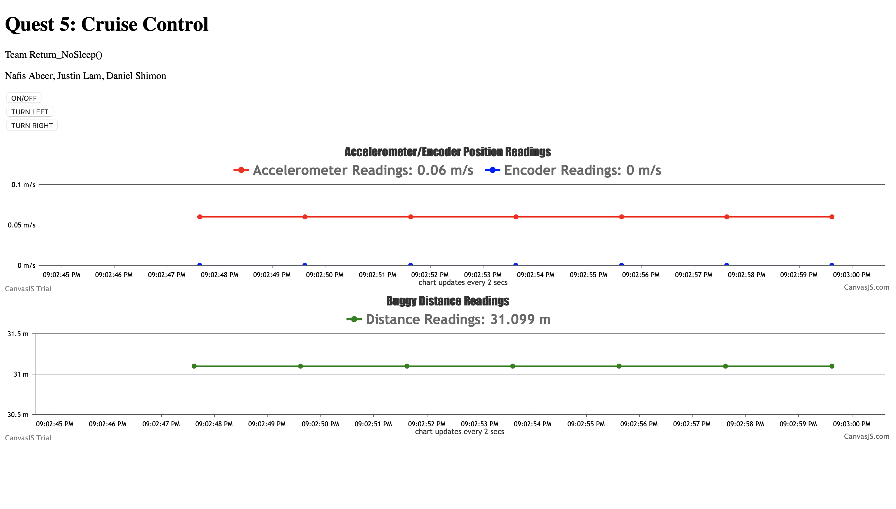
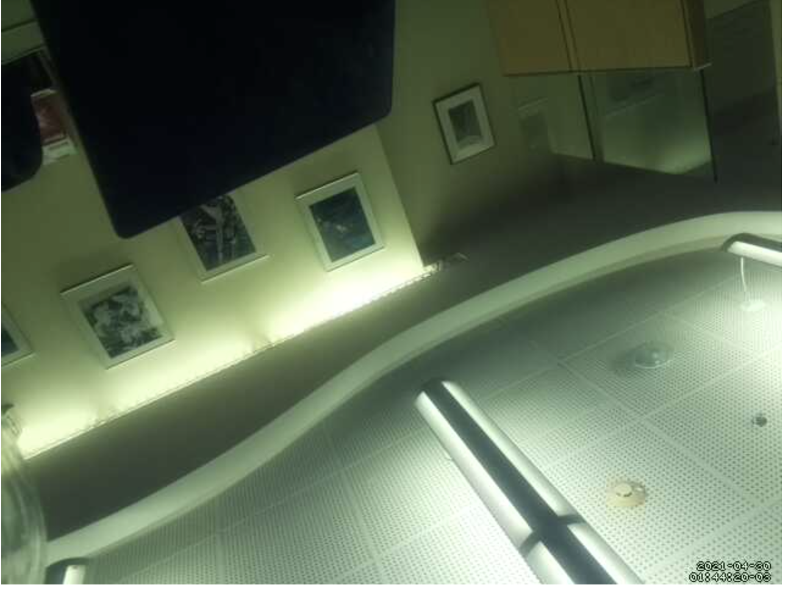
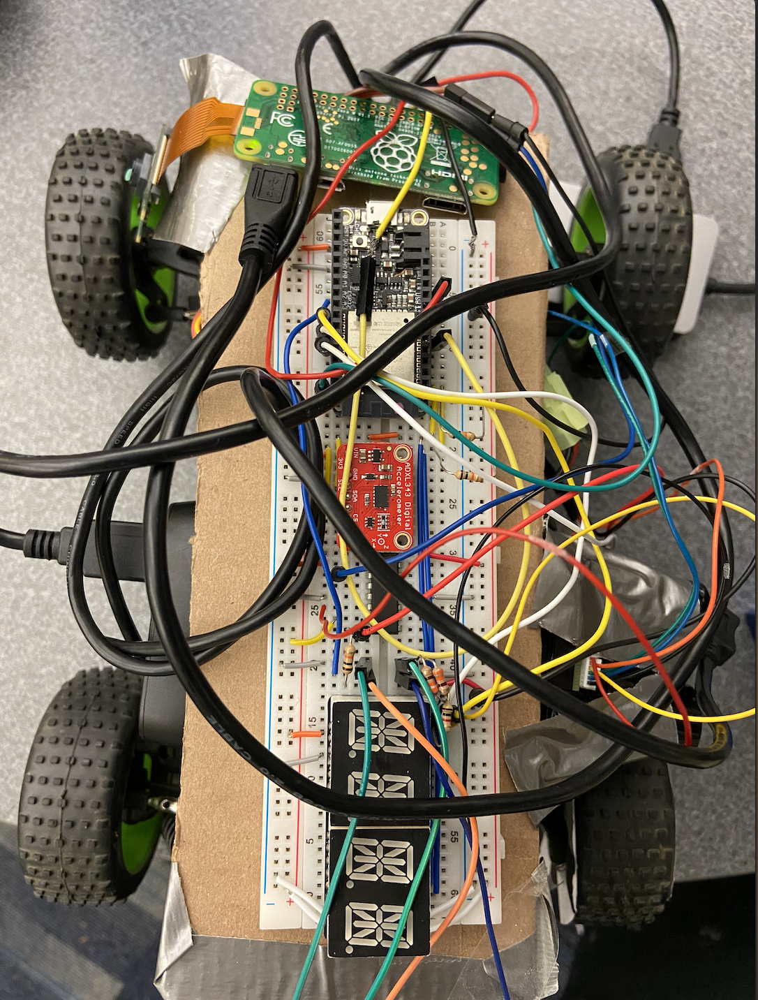
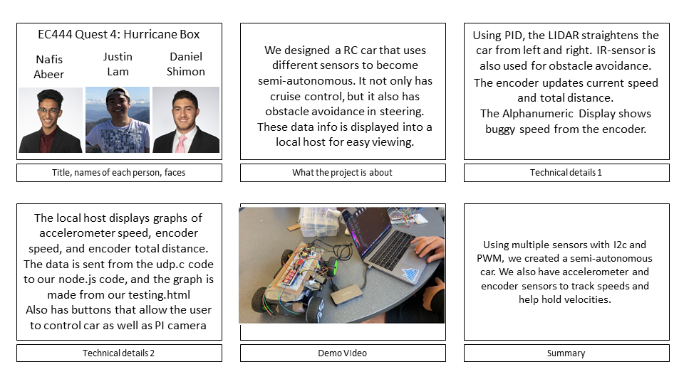

# Cruise Control
Authors: Daniel Shimon, Nafis Abeer, Justin Lam

Date: 2021-04-29
-----

## Summary
In this Quest, we make this Buggy drive itself! By using multiple sensors to work with I2C as well as PWM, we are able to complete this quest. The Lidar Sensor is on the side which we got to work with PWM keeps the car 'in the center of the lane' using PID as well. After testing the ultrasonic sensor, we decided to go with the IR sensor on the front of the car to trigger the stop. The accelerometer measures the x,y,z coordinates of the buggy and calculates a respective speed which is then sent to the server and displayed in a chart. On the same chart the speed measured from the encoder is sent and displayed nicely. This encoder speed is also displayed on the Alphanumeric display in live time. The distance traveled by this encoder's measured speed is also sent to the node server. This quest utilizes many previous skills. Another example is the live camera feed from the Raspberry Pi.

## Self-Assessment

### Objective Criteria

| Objective Criterion | Rating | Max Value  |
|---------------------------------------------|:-----------:|:---------:|
| Objective One | 1 |  1     |
| Objective Two | 1 |  1     |
| Objective Three | 1 |  1     |
| Objective Four | 1 |  1     |
| Objective Five | 1 |  1     |
| Objective Six | 1 |  1     |
| Objective Seven | 1 |  1     |
| Objective Eight | 1 |  1     |
| Objective Nine | 1 |  1     |
| Objective Ten | 1 |  1     |

### Qualitative Criteria

| Qualitative Criterion | Rating | Max Value  |
|---------------------------------------------|:-----------:|:---------:|
| Quality of solution | 3 |  5     |
| Quality of report.md including use of graphics | 3 |  3     |
| Quality of code reporting | 3 |  3     |
| Quality of video presentation | 3 |  3     |

## Solution Design

Our solution design consists of many sensors and components working through an ESP32 to control an RC car. The H-bridge connects our sensors and logic design to our RC-Car. Our LIDAR sensor influenced steering left/right/straight, while our IR sensor controls obstacle avoidance and seeing in front. The encoder calculates speed and distance, and the alphanumeric display shows this speed. The accelerometer is used as a backup sensor, and is compared graphically to the encoder sensor in the node server.

We have our steering to maintain a distance of 25 cm from a wall by using a Lidar sensor and proportionally steering back towards center if an errorous value (not 25cm) is read in from the Lidar. Our collision detection makes use of PID in the sense that it slows the car down first when approaching an object and comes to a full stop if it reaches 20cm from the object at the end point. This quality could be thought of as collision detection, as  we are able to stop the vehicle and redirect it in another direction from the remote server. We are able to start and stop the vehicle from a remote location and we added code to turn left and right too from the website, but the steering components are a bit late to respond. We display the whereabouts of the BUGGY with the help of a camera attached to a raspberry pi that we can access through a local host (local IP of Pi and port 8081). We are able to maintain a cruise control speed due to fine tuning of the PWM values inputed to the forwarding unit, and utilizing the PID operations with a set-point distance of 20cm (which must be maintained from the IR sensor). For this reason our vehicle accelerates to a constant speed upon receiving a start signal. Our Steering could have better used PID better but finetuning Ki and Kd proved to be rather difficult.

#### Hardware
#### RC-Car
  - 7.2 power connector & battery
  - ESC "Servo" connector
    + Ground
    + 5V
    + GPIO -> pin 18 on ESP32
  - Steering Servo connector
    + Ground
    + 3.3V
    + GPIO -> pin 21 on ESP32
  - Front/Back Motors

#### H-bridge
  - Ground
  - VCC1 -> 3.3V
  - 1,2EN -> 3.3V
  - 1A -> 3.3V
  - Lidar -> 2Y
  - Steering -> 1Y
  - Vcc2 -> 5V
#### Accelerometer
  - Ground
  - 3.3V
  - pin
#### Alphanumeric Display
  - Ground
  - 3.3V
  - SCL -> pin 22 on ESP32
  - SDA -> pin 23 on ESP32
#### encoder
  - Infared LED
    + Collector/Emitter pins
    + 3.3V and 660 ohms
  - Phototransistor
    + Cathode/Anode Pins
    + 5V and 10k ohms
#### LIDAR-sensor
  - Ground
  - PWM -> pin 4 on ESP32
  - Trigger pin -> pin 5 on ESP32
  - 5V
#### IR sensor
  - Ground
  - 5V
  - ADC -> pin 33 on ESP32

  Code Readme: (has the documentations for the c, js, and html files)
  

## Investigative Question
Depending on what "adaptive" means, cruise control behavior could be altered simply by changing the forwarding unit value after calculating the PWM proportionality to speed proportionality. If "adaptive" means being able to choose a speed to be cruising at, we can allow user to input speeds in our web-server, and use the proportionality in the PID_forwarding function to set the cruising speed to that speed, so long as we are not approaching a collision. If adaptive means maintaining a set distance from a moving object in front of the vehicle, we can update our PID_forward function such that if the desired distance from said object is smaller than the measured distance, we speed up and slow down in the vice versa case. In either scenario, we would update the part of our code that tell the vehicle to cruise in the case that there is no collision approaching.

## Sketches and Photos

Web Server:

Live feed:

Buggy Circuit:

## Supporting Artifacts
https://www.youtube.com/watch?v=39ZhzLlYEgI

Storyboard:

Code:

## Modules, Tools, Source Used Including Attribution

ESP32,
RC-Car
H-bridge
Accelerometer
Alphanumeric Display
encoder
LIDAR-sensor
IR sensor,
Raspberry Pi Camera
timer interupts and handlers,
UDP,
Node.js,
Canvas.js

## References
https://www.w3schools.com/tags/att_form_method.asp
-----
