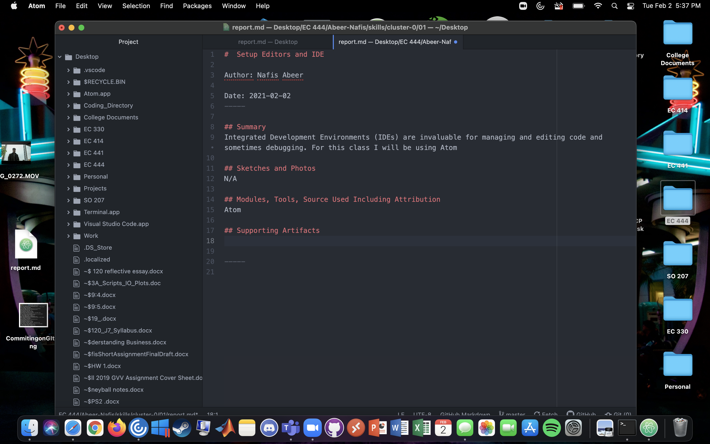

#  Setup Editors and IDE

Author: Nafis Abeer

Date: 2021-02-02
-----

## Summary
Integrated Development Environments (IDEs) are invaluable for managing and editing code and sometimes debugging. For this class I will be using Atom

## Sketches and Photos
N/A

## Modules, Tools, Source Used Including Attribution
Atom

## Supporting Artifacts

-----
