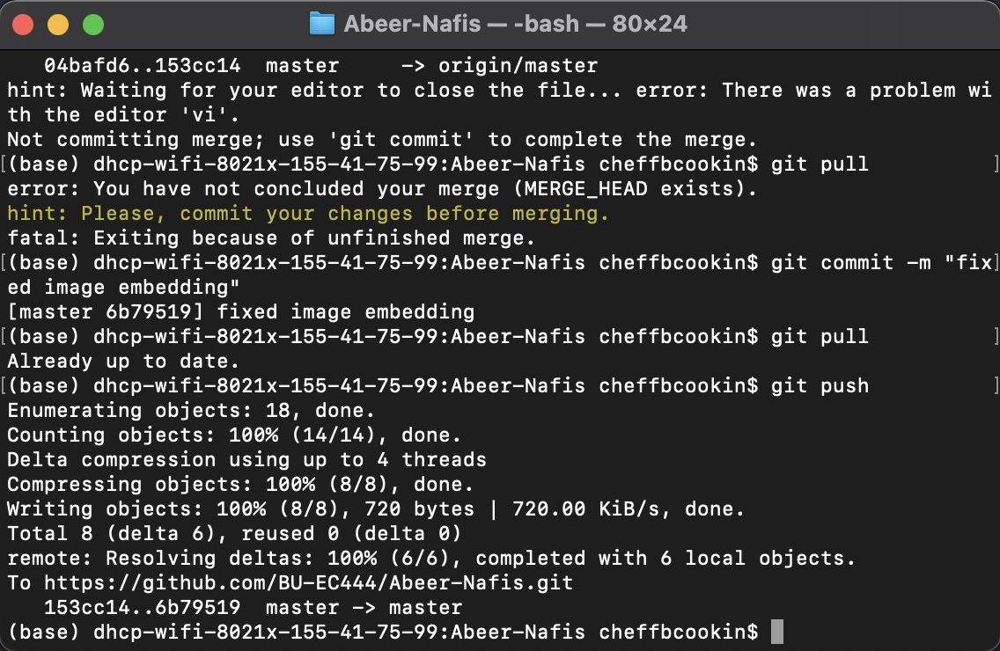

#  Set up and Use GitHub Individually

Author: Nafis Abeer

Date: 2021-02-02
-----

## Summary
Setting up and using Github account and posting account to blackboard.

## Sketches and Photos

## Modules, Tools, Source Used Including Attribution
GitHub

## Supporting Artifacts
https://github.com/BU-EC444/Abeer-Nafis

-----
