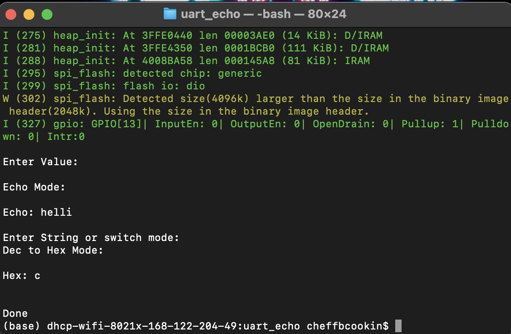

#  Console I/O

Author: Nafis Abeer

Date: 2021-02-12
-----

## Summary
To communicate between users PC and ESP32 over a wired network. This is accomplished through use of Uart_Echo. User input is treated differently based on which mode the program is in at the time of input. Users could switch mode through the press of a button.

## Sketches and Photos

## Modules, Tools, Source Used Including Attribution
ESP 32
Visual Studio Code

## Supporting Artifacts

-----
