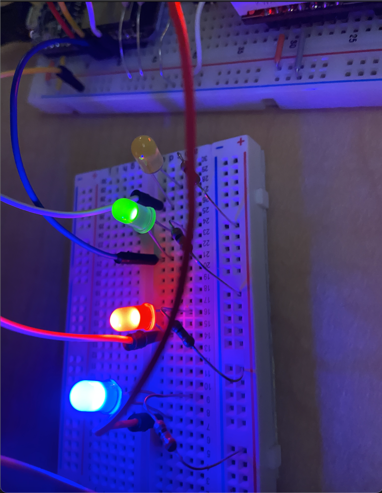
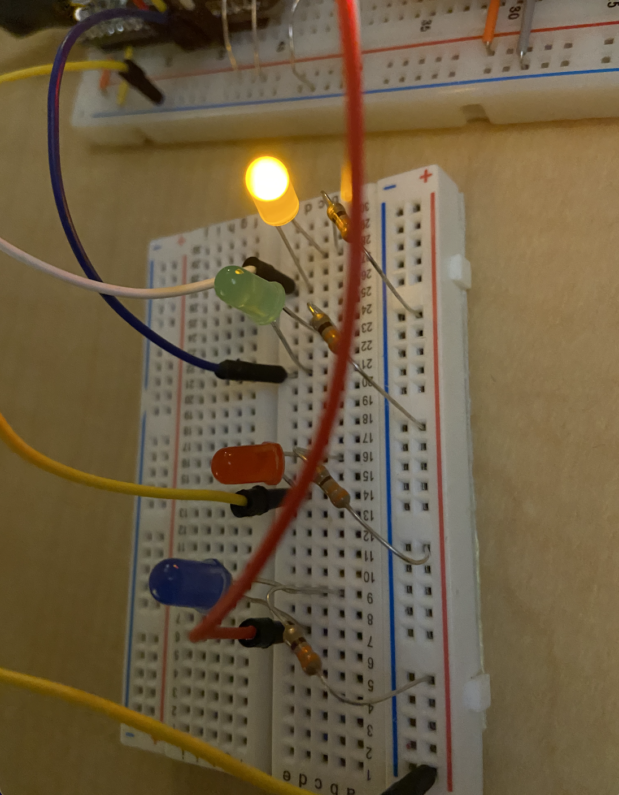
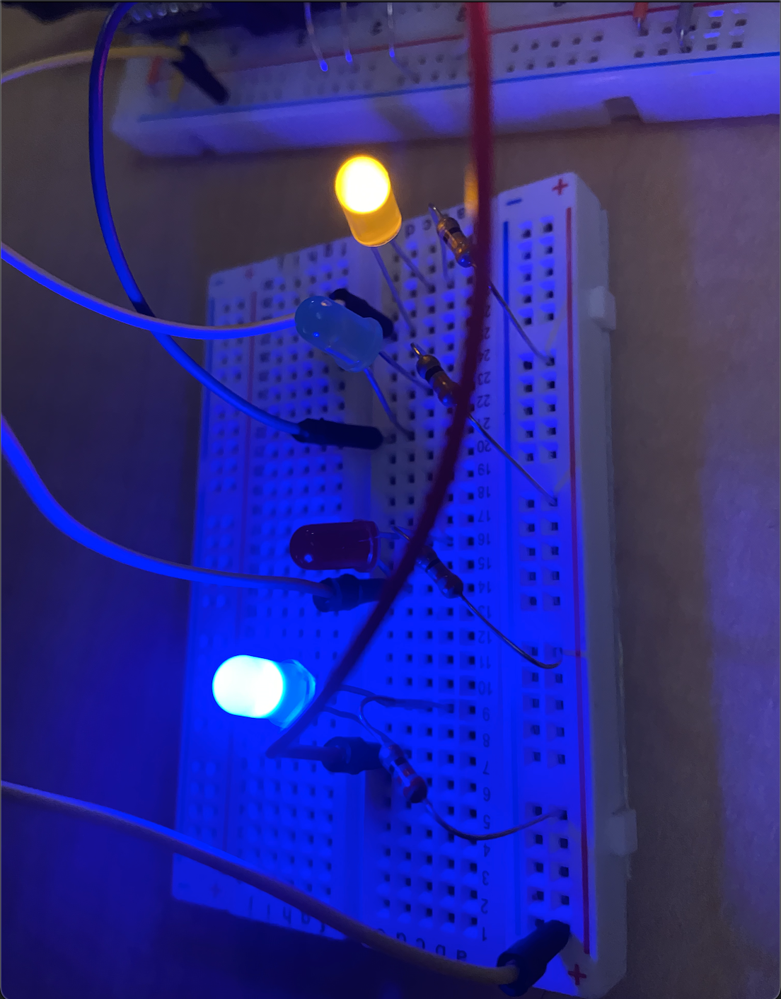

#  Use GPIO to Drive LEDs

Author: Nafis Abeer

Date: 2021-02-05
-----

## Summary
Modified blink.c file to have LED lights light up in order to represent the decimals 0 to 15 in binary. If LED light is on it corresponds to binary 1 and off means binary 0. The lights must be placed with certain pins in order to display correct order.

## Sketches and Photos

## Modules, Tools, Source Used Including Attribution
ESP32
LED lights

## Supporting Artifacts

-----
