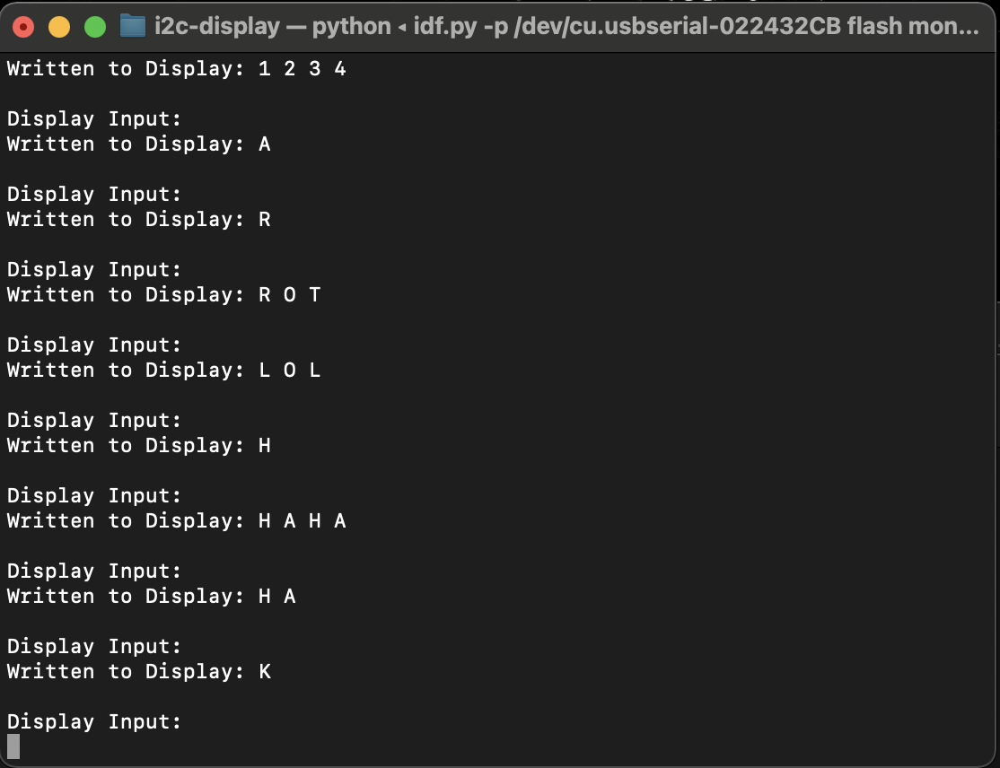

#  Alphanumeric Display

Author: Nafis Abeer

Date: 2021-14-02
-----

## Summary
Each digit on the alphanumeric display is 14 LED segments plus a decimal point LED. With different combinations of the 14 segments turned on and off you can form most letters and numbers. We took the Alphanumeric conversions from Adafruit's Open-Source Github page and converted the array to 'C' form. The elements of the array were in ASCII order, so we take input into a char array from the user and convert the chars to their integer equivalent and scan the Alphanumeric array to convert the integer equivalents to its 16bit equivalent. After that we set the display buffer and we can display the input.

## Sketches and Photos

Image:

## Modules, Tools, Source Used Including Attribution
Visual Studio
I2C display
ESP32

## Supporting Artifacts

https://youtu.be/axSg595U2HM

-----
