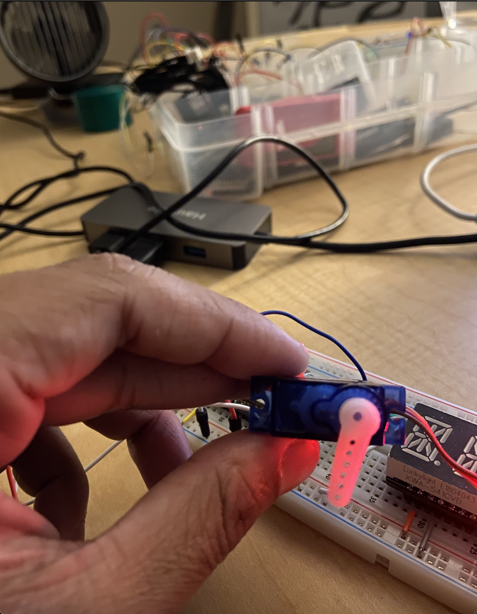

#  Servo

Author: Nafis Abeer

Date: 2021-02-18
-----

## Summary
Make servo move 180 degrees by performing calculations by finding the input pulse width. We experimented and found that the range 500 to 2500 us allowed our to turn 180 degrees

## Sketches and Photos
Terminal:

Servo:

## Modules, Tools, Source Used Including Attribution
servo
ESP32
Breadboard

## Supporting Artifacts

-----
