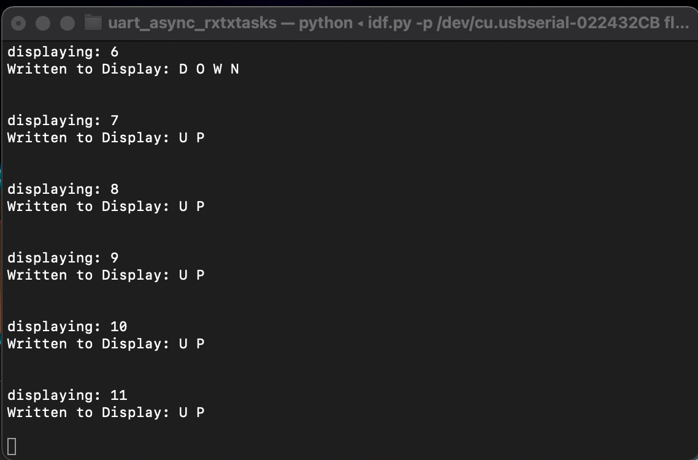
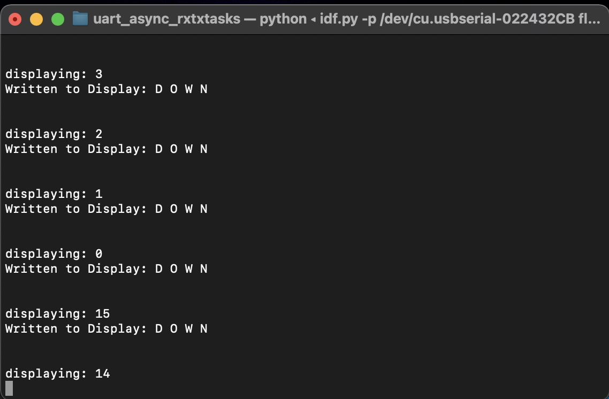

#  freeRTOS

Author: Nafis Abeer

Date: 2021-02-18
-----

## Summary
FreeRTOS used to schedule tasks based on priority. The tasks are to count up or down in binary every second using 4 LED lights connected to pins of the ESP32, display is the current mode is up or down in the i2c display and to be able to toggle between up or down using an interrupt button. Threading used to simultaneously run all tasks.

## Sketches and Photos

## Modules, Tools, Source Used Including Attribution
ESP32
FreeRTOS
i2c Display
LED lights

## Supporting Artifacts

-----
