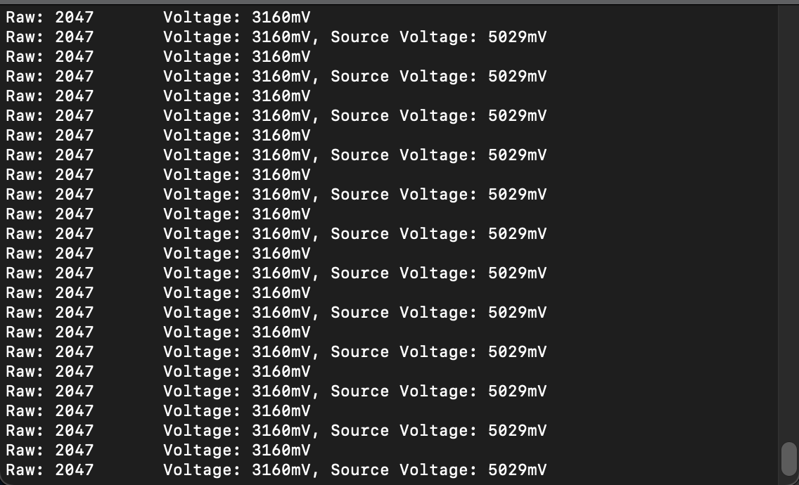

#  Battery Voltage Monitor

Author: Nafis Abeer

Date: 2021-02-25
-----

## Summary
We used i2c code mixed with adc code to be able to display how many volts were being outputted to a certain point in a basic circuit. This allows us to mess around with voltage output, and output a certain amount of volts required to run certain sensors in future tasks

## Sketches and Photos
Working circuit:

Display to console:

## Modules, Tools, Source Used Including Attribution
ESP32
i2c Display
adc
resistors

## Supporting Artifacts
none for this one

-----
