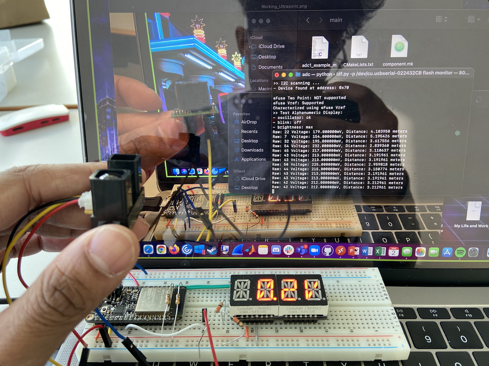

#  IR Sensor

Author: Nafis Abeer

Date: 2021-03-02
-----

## Summary
We now calculate distance of nearest objects that an IR sensor is facing. Because of the configuration of the sensor, closer objects corresponds to voltage readings that are higher, and further objects mean lower voltages. We had to use the data sheet to calculate the inverse relationship between the centimeters and output voltages that are read in through the ADC. We then take those inverse values and calculate the correct distance in meters and display that to the console. We provide the IR sensor with a 5 volt vcc in.

## Sketches and Photos
Far object:

Near Object:

## Modules, Tools, Source Used Including Attribution
ESP32
IR sensor

## Supporting Artifacts
N/A

-----
