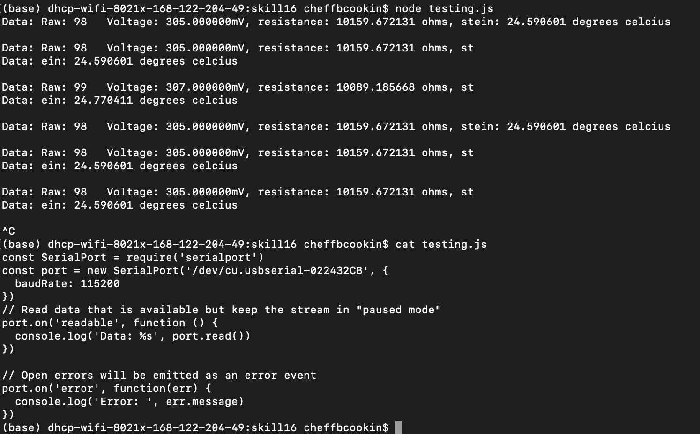

#  Node.js

Author: Nafis Abeer

Date: 2021-03-02
-----

## Summary
This task was more of a tutorial to get handy with node.js. We install node into our devices and figures out how to monitor the esp console through node. 

## Sketches and Photos

## Modules, Tools, Source Used Including Attribution
ESP32
Node.js

## Supporting Artifacts
N/A

-----
