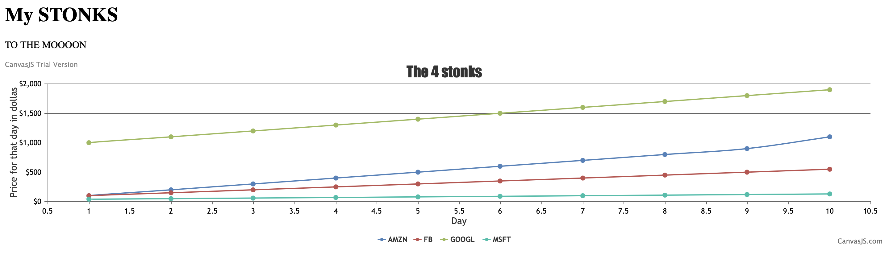

#  CanvasJS

Author: Nafis Abeer

Date: 2021-03-05
-----

## Summary
Getting familiar with canvasjs. Read data in from a csv file into a node javascript file. Use an HTML file to send data in to a local host and plot the data into the website.

## Sketches and Photos

## Modules, Tools, Source Used Including Attribution
ESP32
Canvas.js
Node.js
CSV

## Supporting Artifacts

-----
