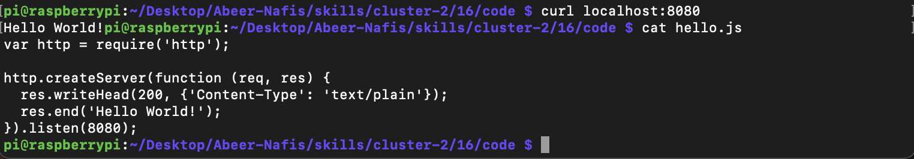
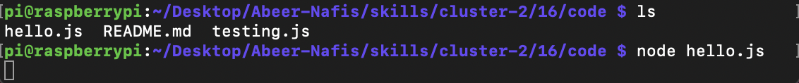

#  RPI

Author: Nafis Abeer

Date: 2021-03-06
-----

## Summary
Set up RPI, gave it life, and printed hello world to RPI's local host using node

## Sketches and Photos
RPI Terminal:

## Modules, Tools, Source Used Including Attribution
RPI
Node.js

## Supporting Artifacts
https://learn.adafruit.com/raspberry-pi-zero-creation/give-it-life-1

-----
