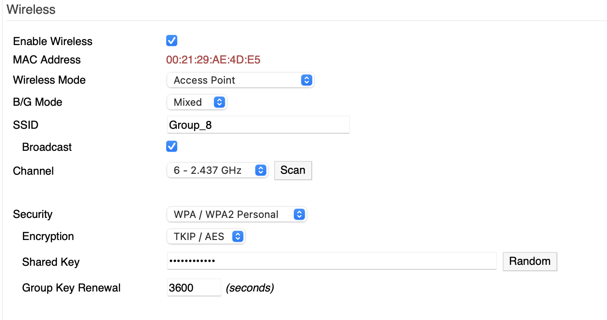

#  Router

Author: Nafis Abeer

Date: 2021-03-12
-----

## Summary
Attempted setup of RPI as router, but it prevented the ability to ssh into the rpi. Second approach was setting up a router given to us, and changing the ssid to our group number. I was then able to connect to the RPI over this router using ssh.

## Sketches and Photos

## Modules, Tools, Source Used Including Attribution
- Linksys router
- RPI Zero

## Supporting Artifacts
N/A

-----
