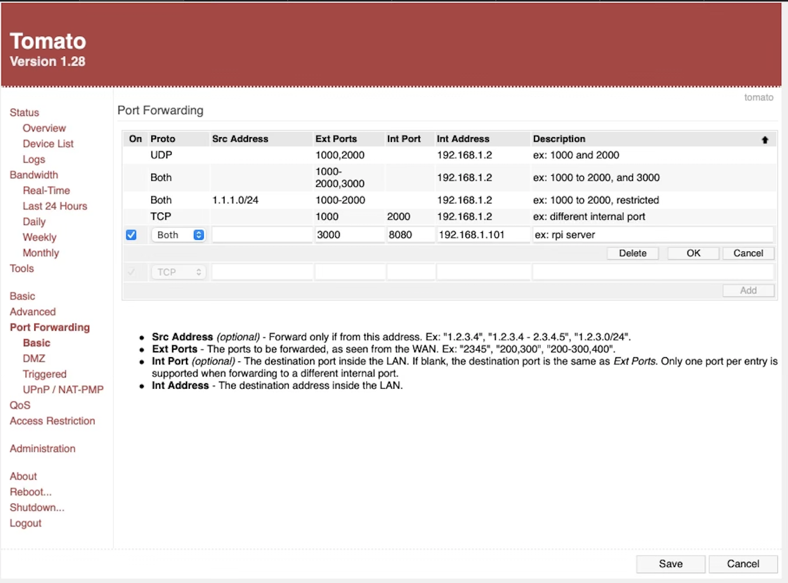
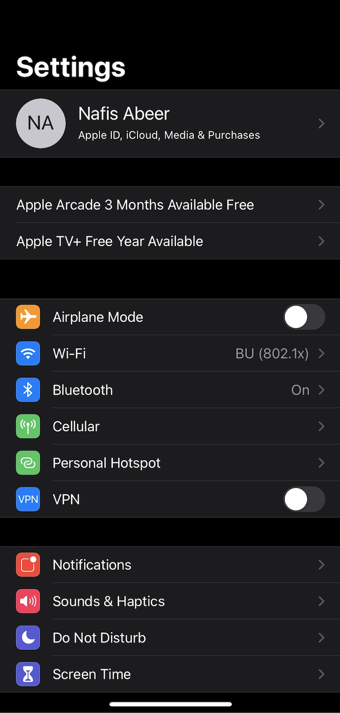
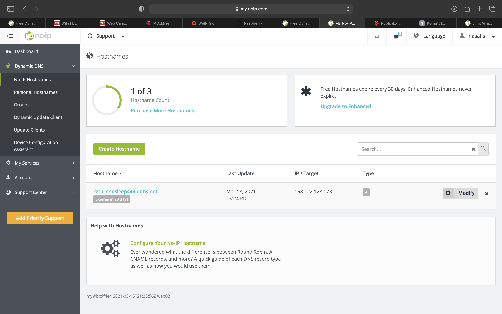
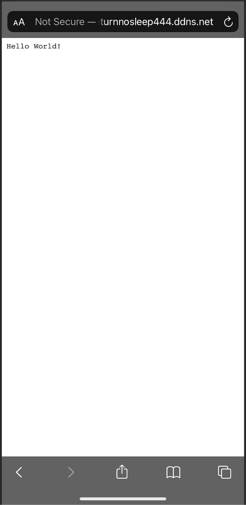
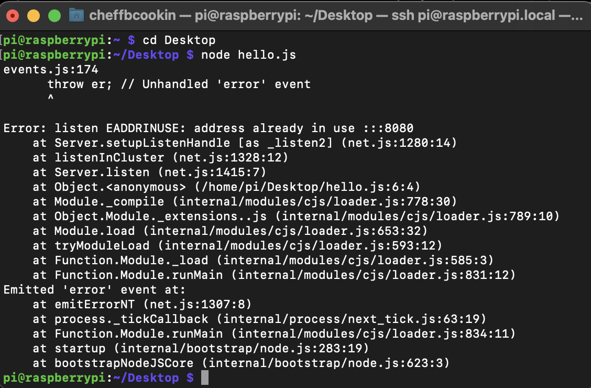

#  Dynamic DNS

Author: Nafis Abeer

Date: 2021-03-15
-----

## Summary
Connected my router a dynamic DNS server through services provided by No-Ip. Then I found my RPI's local IP address and set that as the internal address to port-forward. I wrote a sample nodejs program that printed "Hello World!" and set it to display to port 8080. So 8080 was also set as the internal port for port-forwarding. We chose 3000 to be the external port that we view the contents in, and then typed in the no-ip hostname:external_port on a different wifi to demonstrate the ddns server's functionality.

## Sketches and Photos
Port Forward:

Wifi:

No-Ip:

Working server:

Node program running:

## Modules, Tools, Source Used Including Attribution
- ddns
- port forwarding
- Linksys Router
- RPI
- Nodejs

## Supporting Artifacts

-----
