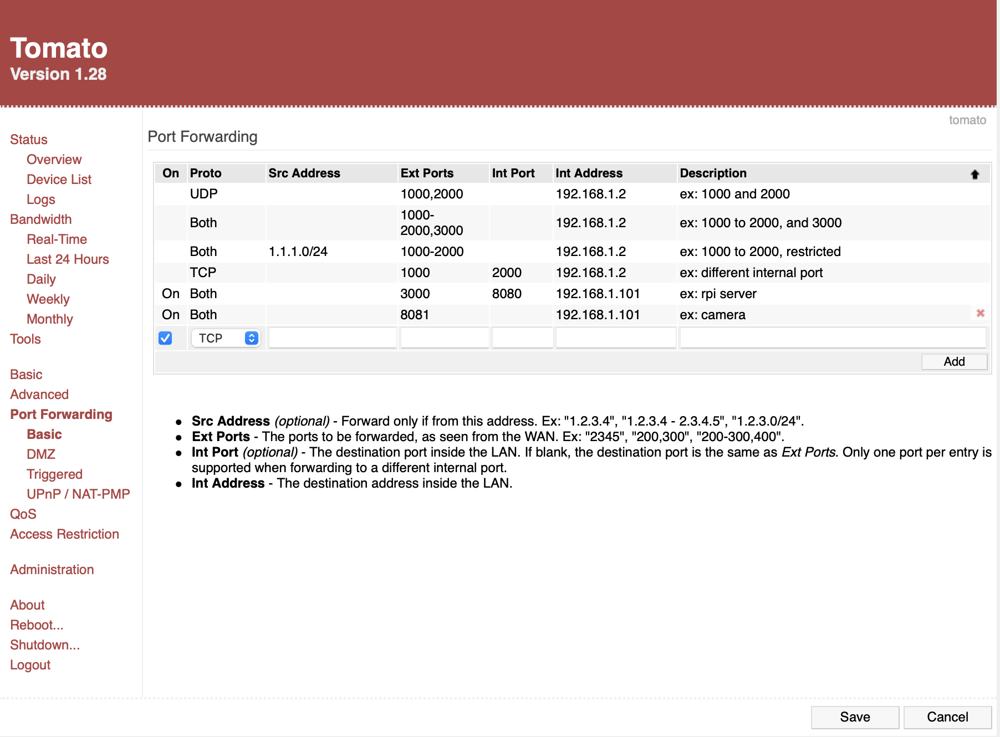
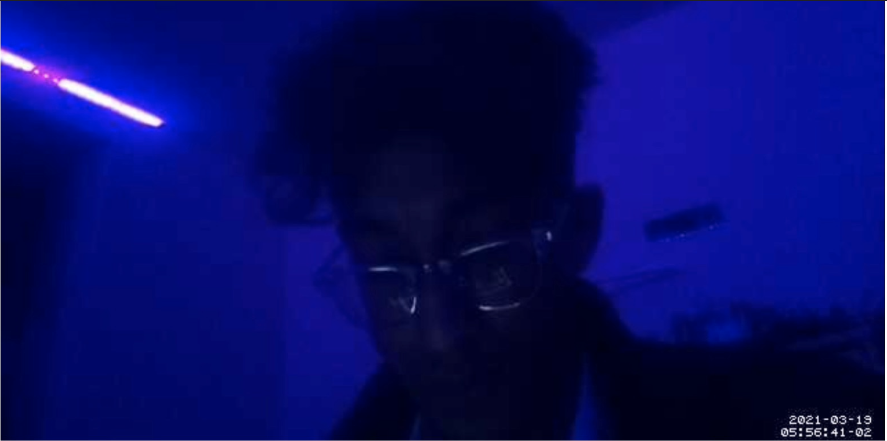
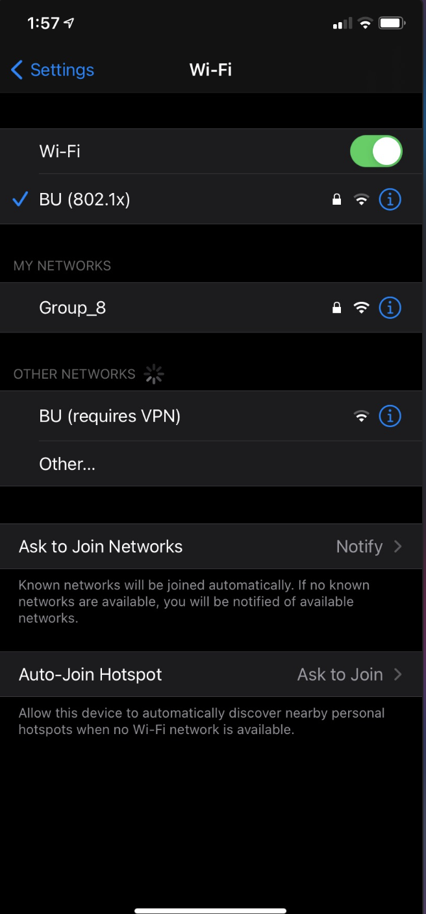
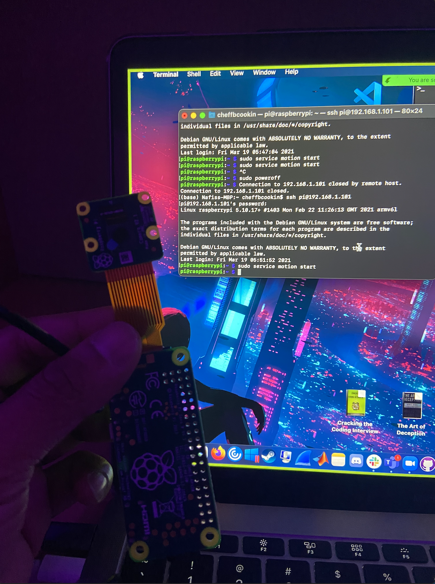

#  Web Camera on Pi Zero

Author: Nafis Abeer

Date: 2021-03-17
-----

## Summary
Enabled remote desktop and installed motion to RPI zero. Connected camera to RPI and then edited motion configurations. I port forwarded the camera stream to external port 8081 (for webcams). These steps allowed me to just run motion start after rebooting the RPI and I was able to view my live stream from a different wifi.

## Sketches and Photos
Port Forward:

Live stream:

Wifi:

Terminal:

## Modules, Tools, Source Used Including Attribution
- webcam
- RPI Zero
- Port forwarding

## Supporting Artifacts

-----
