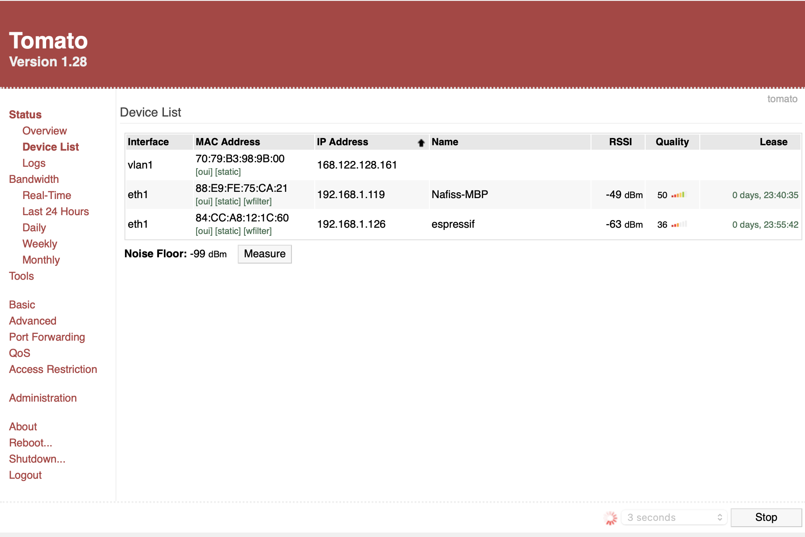
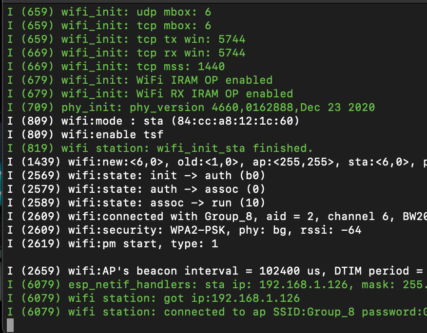

#  Wifi-ESP

Author: Nafis Abeer

Date: 2021-03-18
-----

## Summary
Connected my ESP to wifi, by configuring its ssid to match the same as my router.

## Sketches and Photos

## Modules, Tools, Source Used Including Attribution
- ESP 32
- Lynksys router

## Supporting Artifacts

-----
