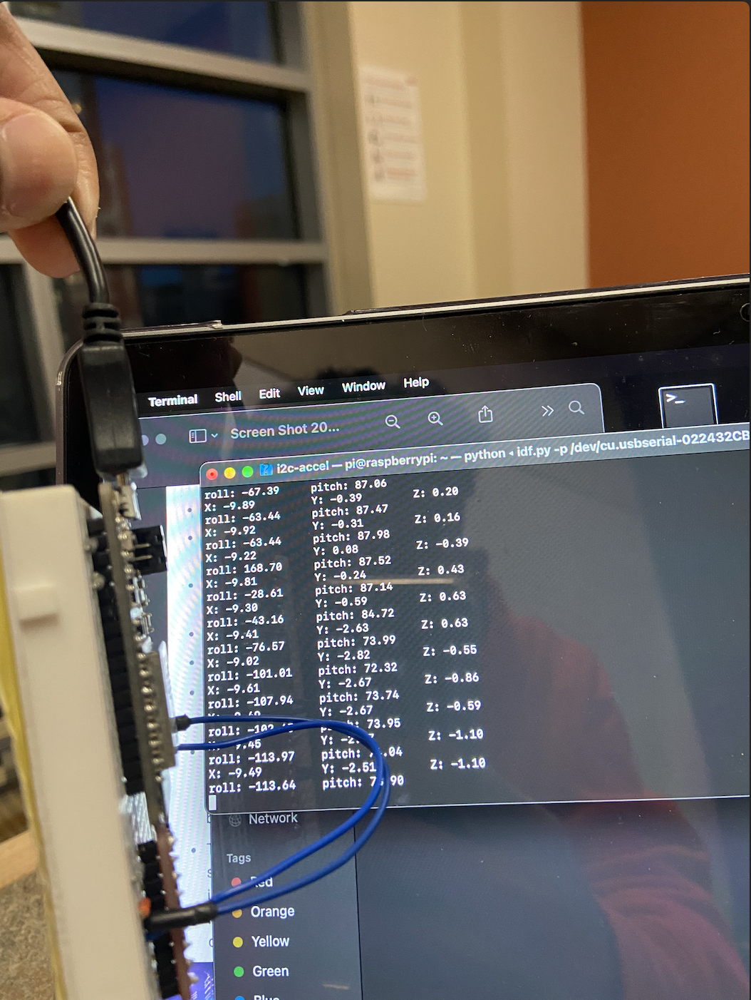
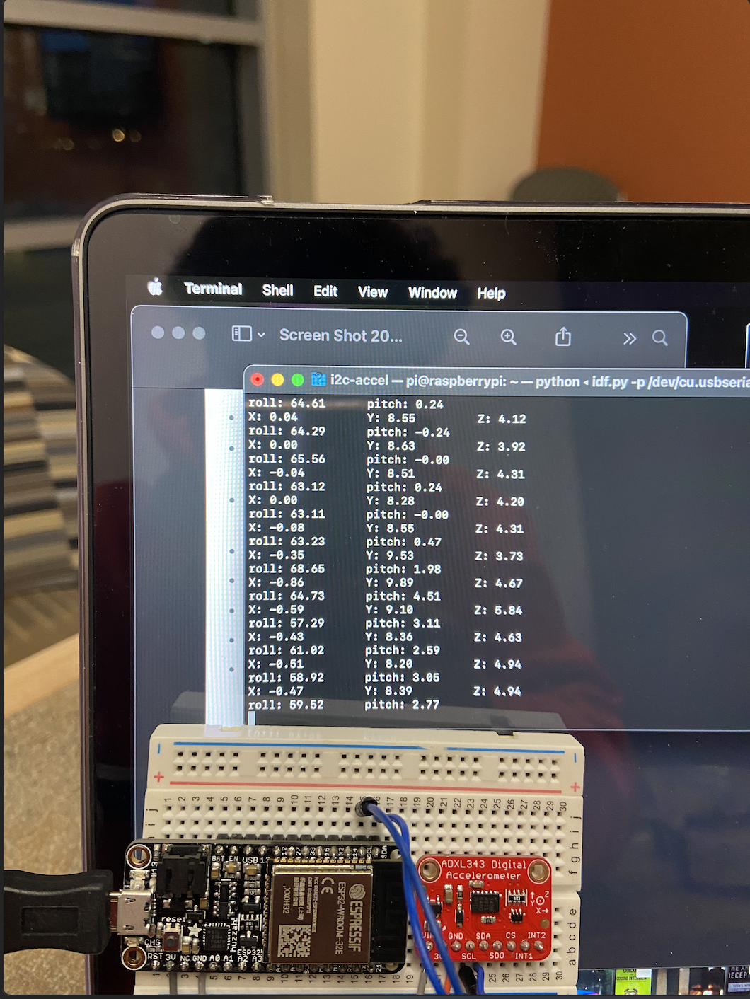
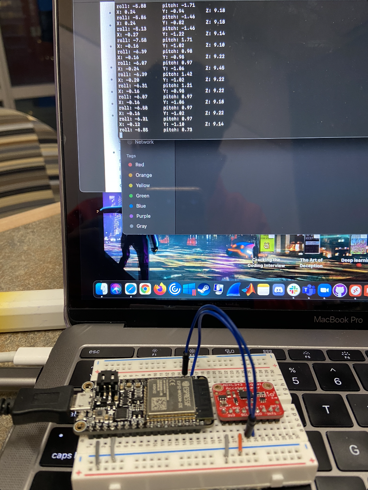

#  Triple-axis accelerometer

Author: Nafis Abeer

Date: 2021-03-19
-----

## Summary
Wrote i2c functions for the accelerometer. There were four functions to be added in total, and the read16 bit function was the one that read specific registers using the SCL and SDA pins from the connceted device. The reading was then converted to acceleration in x, y and z axis and then finally, those accelerations were put into trig formulas to convert to pitch and roll.

## Sketches and Photos
X:

Y:

Z:

## Modules, Tools, Source Used Including Attribution
- ADXL343 accelerometer
- i2c
- ESP32

## Supporting Artifacts

-----
