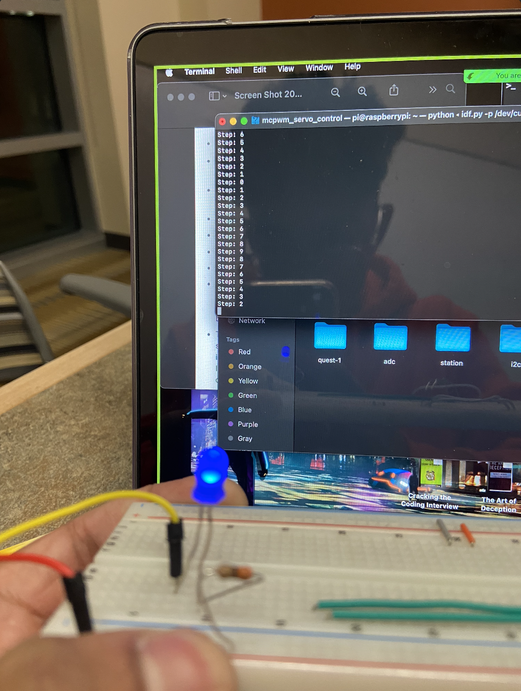
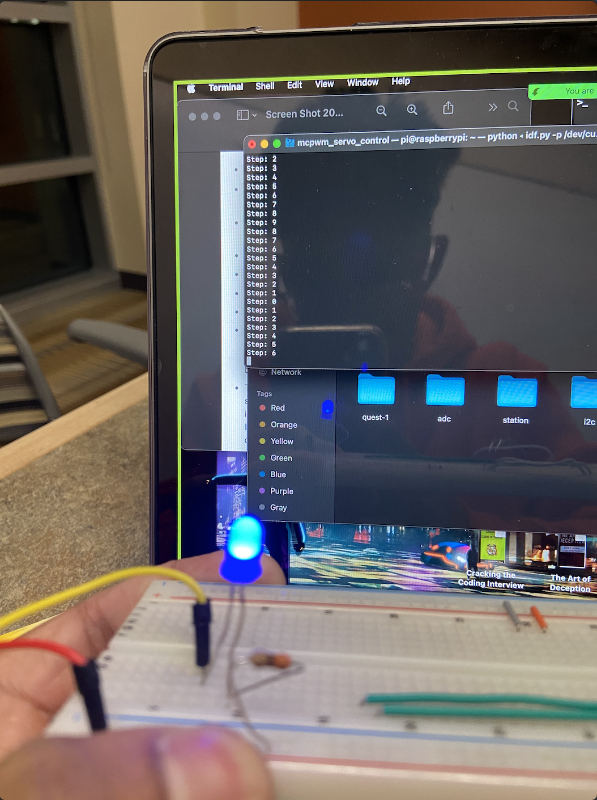

#  Use PWM to control power delivery to LEDs

Author: Nafis Abeer

Date: 2021-03-20
-----

## Summary
We used PWM to serve a smaller or bigger sized pulse of current to the LED light based on the percentage at the time. If the percentage is higher, the pulse is longer and vice versa. 

## Sketches and Photos
Dim:

Not Dim:

## Modules, Tools, Source Used Including Attribution
- PWM
- LED light
- ESP32

## Supporting Artifacts

-----
