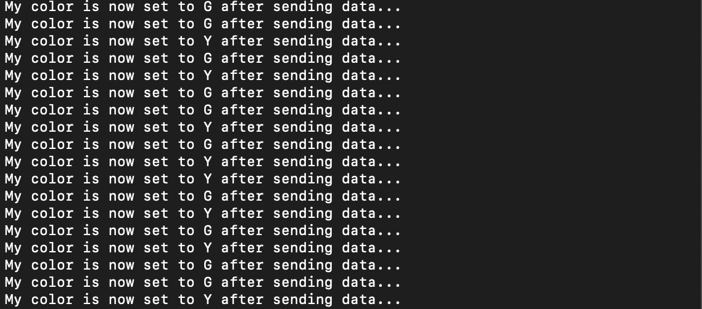
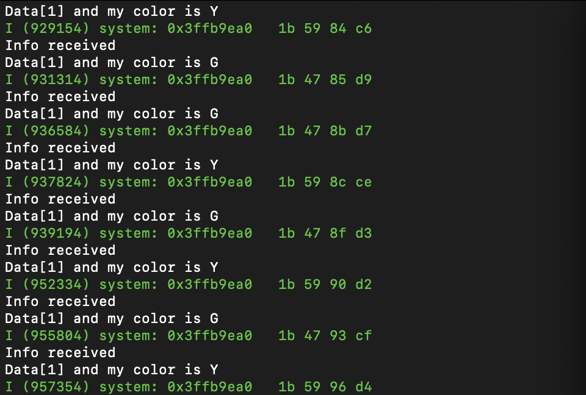

#  IR TX/RX

Author: Nafis Abeer

Date: 2021-04-06
-----

## Summary
We wired out two set of ESP32s with IR transmitters and receivers. Then we plugged in some LED lights and a button into each ESP32. Our implementation of the IR sensors demonstrate transmission of the signal from one ESP32 due to the press of a button, and reception of the signal at another ESP. The signal contains info about which state to set the receiver to, while also setting the state of the sender to that same state. Meaning, when one of ESP presses the button and successfully transmits data to another ESP, both ESPs should have the same LED light on.

## Sketches and Photos
sending terminal:

receiving terminal:

## Modules, Tools, Source Used Including Attribution
- ESP32s
- TSOP diodes
- IR diodes
- LED lights
- RMT

## Supporting Artifacts
Youtube video for working demo:
https://youtu.be/TJCD3sz2cYI
-----
