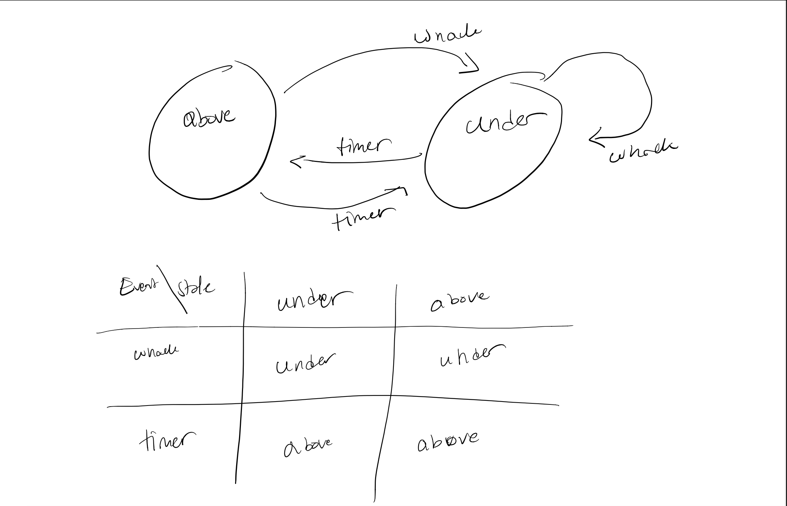

#  State Models

Author: Nafis Abeer

Date: 2021-04-13
-----

## Summary
Designed a state machine for a whack a mole game. Used events to determine next state.

## Sketches and Photos

## Modules, Tools, Source Used Including Attribution
C?

## Supporting Artifacts
N/A

-----
