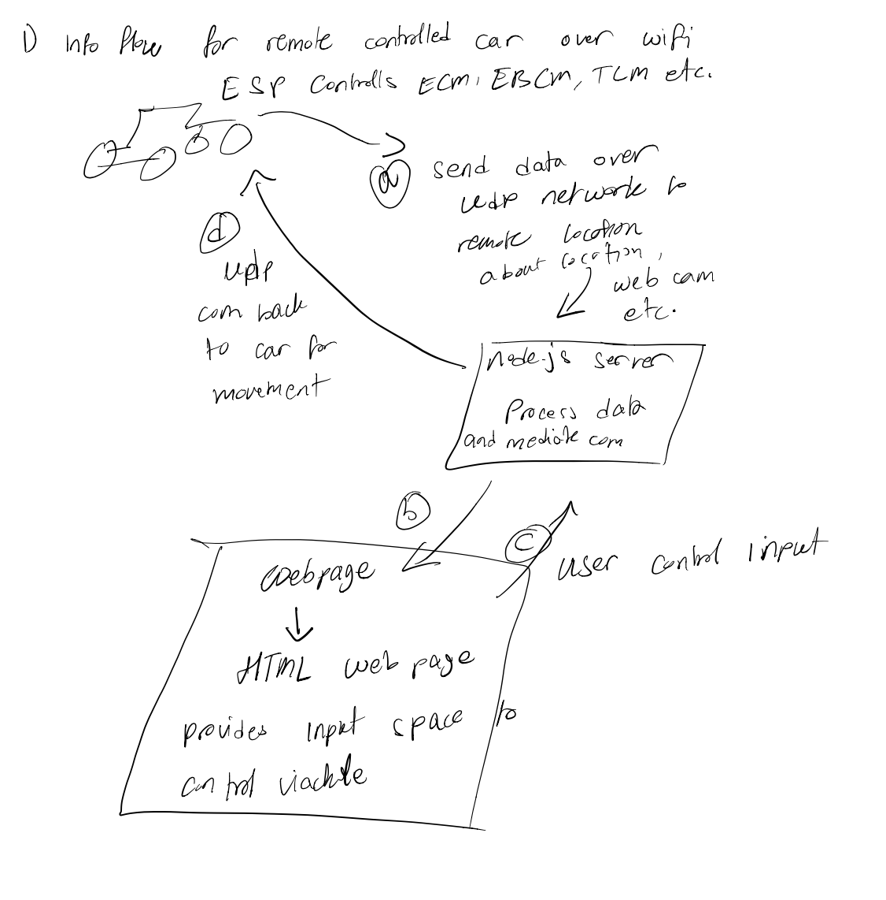

#  Security Issues

Author: Nafis Abeer

Date: 2021-04-13
-----

## Summary
1) Additional image outlines flow of information. Similar to how we sent data and controlled LED from a remote location, we can use ESP GPIO pins to control input to vehicle. We can monitor the vehicle similar to how we monitored the box over the camera.

2)
- Potential avoidable weakness could be allowing IoT device to receive connection requests. This would be equivalent to the device acting as both a client and a server. For this reason our IoT device can only initiate connections themselves.
- Our client right now communicates over a local network, and for our distributed system (leader election) we had to multicast data which can be intercepted by malicious devices with access to the local network.
- If we want to have our car travel far, we may purely be communicating over the internet using ddns to access the local network of the vehicle. In this scenario, exposing the domaine name and port could leave our vehicle vulnerable.

3)
- We are using UDP so we are vulnerable to DoS attacks because someone could just flood our network with multicast UDP packets and we would be unable to send or receive necessary information to control the vehicle. This is assuming that our local network information had been exposed.
- Rogue access point attacks are possible because our network does not have any specific firewalls to block users and any one with knowledge of the HOST for the vehicle could simply just connect to it and send it information. There is no user login set up for the vehicle.
- We are susceptible to eavesdrop attacks because someone could access our ddns port and watch our vehicles camera feed. Someone could take our vehicle and insert malware onto its control chip and this could allow some random socket to just be listening to our feed without being noticed, sort of like a man in the middle attack. In fact, this man in the middle could feed false information to both the vehicle and the server without either end point being aware of it.
- Copy cat attacks: someone could mask their IP address to be the same as one of the endpoints and receive information from the other endpoint. This can expose our location and the vehicle locations along with any information stored at either endpoints
- Endpoint attacks because our vehicles are mobile and someone could pick up the device and physically install chips onto the device. They can do a range of damage from manipulating the on board ESP and masking the effects from the server to adding malware that would send malicious information back to the server.

4)
- We can consider leveraging the cloud into our local network so Ddos attacks would impact us less, because we have a lot of available bandwidth.
- To prevent Rogue access attacks we could practice maintaining strong security by using complex encryption to set up our log in passwords for our network.
- To prevent eavesdrop attack we can transport data using more secure protocols and set up firewalls to prevent access to communicating network.
- To prevent copycat attacks we can ask for proof of identification from endpoints before communication. 
- To prevent outside access to vehicle we can train its controls to lock if any outside device attempts to physically connect. In order to access on board microcontroller, there will be password requirements and all info on memory cards will be encrypted.

## Sketches and Photos
Flow of information:

## Modules, Tools, Source Used Including Attribution

## Supporting Artifacts

-----
