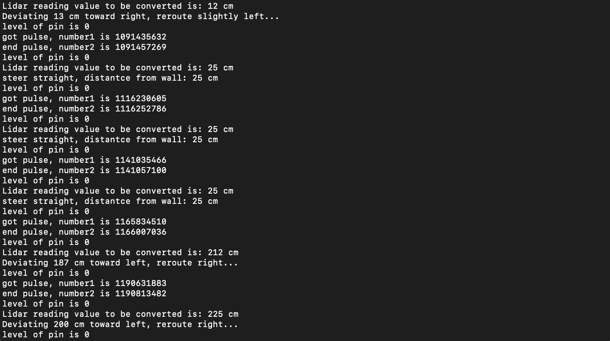

#  Lidar Lite

Author: Nafis Abeer

Date: 2021-04-28
-----

## Summary
The Lidar lite skill required us to use either PWM or I2c or Uart to aquire readings from a version 3 lidar (for me). The lidar setup I had used PWM and it was activated on low pulses, where it would then output a pulse to the ESP what wuld have a duration proportional to the distance reading.

## Sketches and Photos

## Modules, Tools, Source Used Including Attribution
ESP32
LidarLite v3
PWM

## Supporting Artifacts

-----
