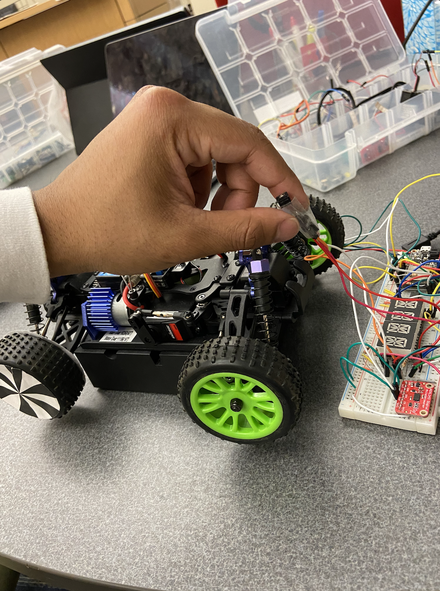

#  Wheel and Car Speed Sensor

Author: Nafis Abeer

Date: 2021-04-28
-----

## Summary
This skill uses the encoder to measure distance and speed of the buggy. By seeing the color difference between black and white, I was able to use the encoder to see how many alterations there were. With the respective formulas in the code, I was able to use these calculations to calculate the two things needed.

## Sketches and Photos

## Modules, Tools, Source Used Including Attribution
- ENCODER
- ESP32
- RBG LED pins

## Supporting Artifacts
N/A

-----
