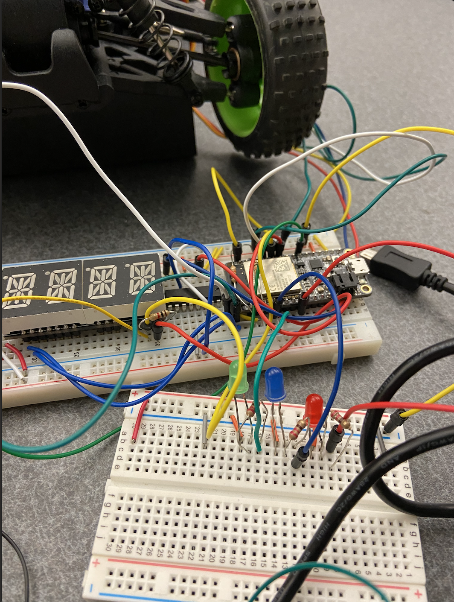

#  PID

Author: Nafis Abeer

Date: 2021-04-29
-----

## Summary
PID uses error check mechanism as well as differences in errors and cumalitive erros to behave accordingly. In this skill we just used the P portion to calculate error from a desired distance and then switched on lights to react to the calculated errors.

## Sketches and Photos

## Modules, Tools, Source Used Including Attribution
- ESP32
- RGB lights

## Supporting Artifacts
https://youtu.be/itCJ88CVu8Y

-----
